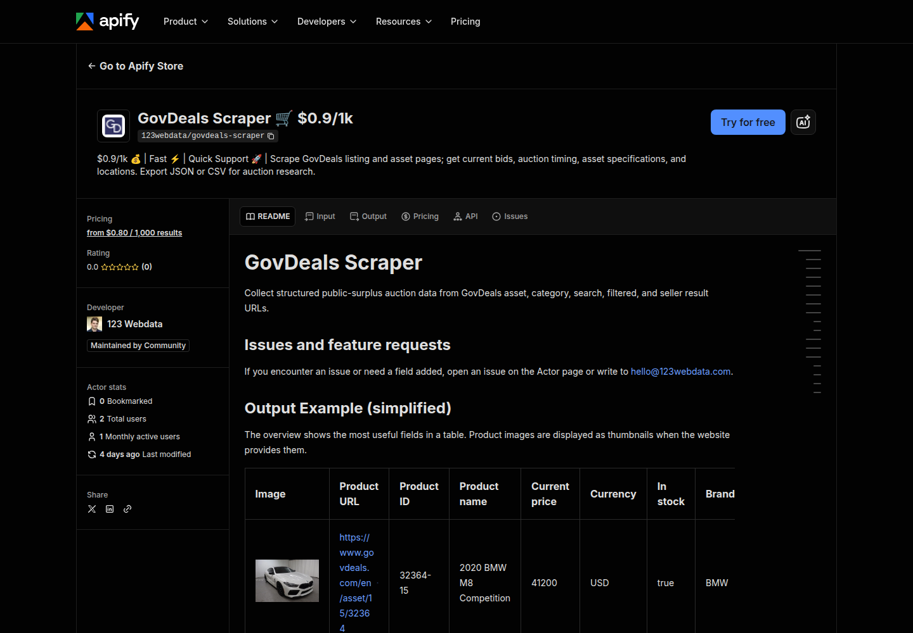
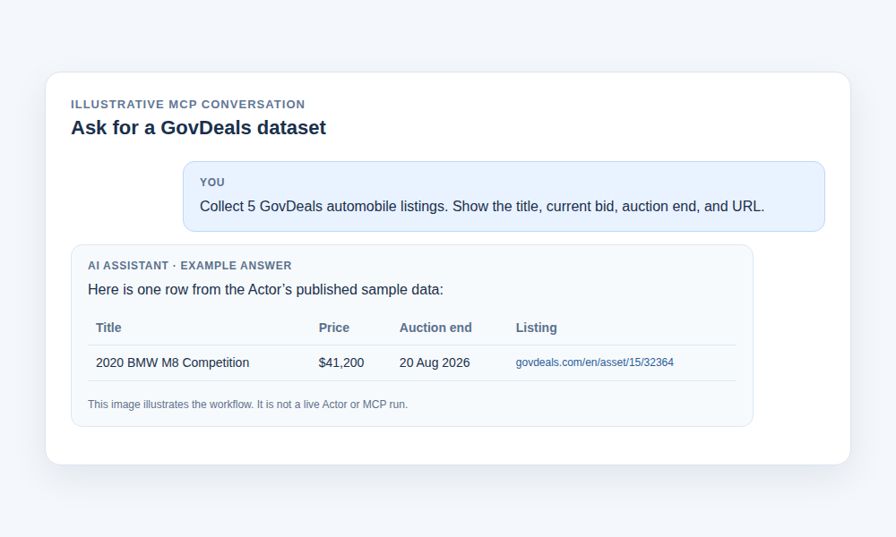

# How to scrape Govdeals

Do you need to collect Govdeals data for your project? Follow the steps below.

This repository uses the [GovDeals Actor](https://apify.com/123webdata/govdeals-scraper?fpr=9lmok3) published on Apify. Apify's Free plan includes **$5 in monthly usage credit**. At this Actor's Free-plan rate, list results cost **$0.89 per 1,000** plus **$0.02 to start a run**; about **5,595 list results in one run** fit within the credit if none has been used elsewhere. Full product-detail records cost $1.99 per 1,000. Prices checked 23 September 2026. The Actor link contains an affiliate code.

One published sample row looks like this (your results will depend on the live listings):

| Auction lot | Current price | Auction ends | Location | Listing |
| --- | ---: | --- | --- | --- |
| 2020 BMW M8 Competition | $41,200 | 20 Aug 2026 | Downers Grove, Illinois | [View lot](https://www.govdeals.com/en/asset/15/32364) |

## Get started on Apify

*Actual Actor page captured 23 September 2026. The button and screen labels may change.*

1. Open the [GovDeals Scraper page](https://apify.com/123webdata/govdeals-scraper?fpr=9lmok3) and click **Try for free**. Sign in if prompted.
2. In the Actor input, clear any example product URLs and add a GovDeals category, search, filtered, or seller URL to <code>categoryUrls</code>. For a small first run, use <code>https://prod-seo.govdeals.com/automobiles-cars</code>, set <code>maxResultsPerScrape</code> to <code>10</code>, turn **Use pagination** off, and turn **Include product details** off.
3. Start the Actor. When the run finishes, open its **Output** or **Dataset** view to inspect the rows. Export JSON or CSV if you need the data in another tool.

## Ask for data from an AI assistant

The same Actor is available through a remote Model Context Protocol (MCP) server. Its URL is in [mcp.example.json](mcp.example.json). Paste that URL into a client with a custom remote-MCP connector, sign in to Apify when prompted, and ask for a GovDeals dataset. Clients that accept <code>mcpServers</code> JSON can use the config file directly.

Setup instructions differ by app: [Claude custom connectors](https://support.claude.com/en/articles/11175166-get-started-with-custom-connectors-using-remote-mcp), [ChatGPT MCP apps](https://help.openai.com/en/articles/12584461-developer-mode-and-mcp-apps-in-chatgpt), and [Cursor MCP](https://prod.cursor.com/help/customization/mcp). Custom MCP availability depends on your app and plan.

*Illustration based on the Actor's published sample row, not a live MCP run. Running the Actor through an assistant can use paid Apify credit.*

## Input schema

For a first category run, the important settings are:

~~~json
{
  "categoryUrls": ["https://prod-seo.govdeals.com/automobiles-cars"],
  "maxResultsPerScrape": 10,
  "usePagination": false,
  "scrapeProductDetails": false
}
~~~

| Field | Type | What it controls |
| --- | --- | --- |
| <code>productUrls</code> | array of URLs | Individual GovDeals asset pages; leave empty for a category run. |
| <code>categoryUrls</code> | array of URLs | Category, search, filtered, or seller list pages to collect. |
| <code>maxResultsPerScrape</code> | integer | Maximum saved product records; default 20. |
| <code>usePagination</code> | boolean | Continue through additional list pages; default true. |
| <code>scrapeProductDetails</code> | boolean | Fetch full asset pages rather than list-level records; default true. |

## Data schema

Each saved lot is one dataset row. With <code>scrapeProductDetails: false</code>, a **Result** row can contain these 15 fields:

<code>url</code>, <code>product_id</code>, <code>name</code>, <code>price</code>, <code>currency</code>, <code>sku</code>, <code>canonical_url</code>, <code>scraped_at</code>, <code>auction_end</code>, <code>location</code>, <code>lot_number</code>, <code>auction_type</code>, <code>badges</code>, <code>main_image</code>, <code>images</code>.

With <code>scrapeProductDetails: true</code>, a **Product detail** row can contain these 25 fields:

<code>url</code>, <code>product_id</code>, <code>name</code>, <code>price</code>, <code>currency</code>, <code>in_stock</code>, <code>sku</code>, <code>brand</code>, <code>category</code>, <code>breadcrumbs</code>, <code>breadcrumb_urls</code>, <code>main_image</code>, <code>images</code>, <code>description</code>, <code>description_html</code>, <code>attributes</code>, <code>canonical_url</code>, <code>scraped_at</code>, <code>auction_end</code>, <code>bid_count</code>, <code>location</code>, <code>lot_number</code>, <code>auction_type</code>, <code>badges</code>, <code>vin</code>.

Fields may be empty or omitted when the source listing does not provide them. Full details cost more than list-level results.

## Run from Python or JavaScript

Copy your Apify API token from **API & Integrations** in your account. Keep it out of Git, then set it for your terminal session:

~~~bash
export APIFY_TOKEN='paste-your-token-here'
~~~

For Python 3.11+:

~~~bash
python3 -m venv .venv
source .venv/bin/activate
pip install -r requirements.txt
python3 govdeals-scraper.py
~~~

For Node.js 20+:

~~~bash
npm ci
node govdeals-scraper.js
~~~

Both scripts run a small category scrape and print up to five JSON rows. Pass a different GovDeals list-page URL as the first argument to either script. A live run consumes Apify credit.

Need a different field or a custom scraping project? Write to [hello@123webdata.com](mailto:hello@123webdata.com).
